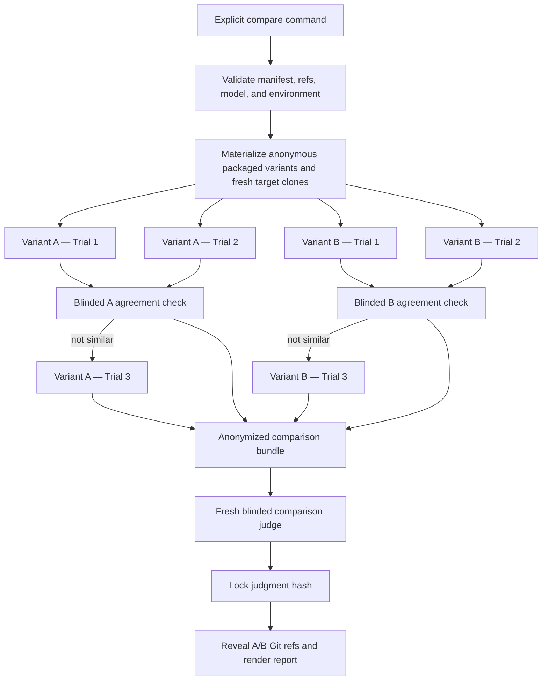

# Material Review Skill-Version Evaluation Design

- **Status:** Approved design
- **Date:** 2026-07-27
- **Affected capability:** Repository-maintainer evaluation tooling for `material-code-review`
- **Runtime semantic change:** None in this design-only change

## Summary

Add an explicitly invoked, local evaluation harness for comparing two immutable versions of the `material-code-review` skill against a version-controlled suite of frozen Git diffs. The first benchmark is the Discogs album-recovery change:

```text
Repository: https://github.com/CoveMB/discogs-collection
Baseline:   4e59c674dae10a4edcb8952818364c6faa255389
Comparison: 42a74b8619054800eca8502d8a687d3c98102565
```

The harness runs two isolated review trials per anonymous skill variant, uses a fresh blinded agent to decide whether each pair agrees materially, and runs a third trial only for a variant whose first two trials do not establish material similarity. A separate blinded comparison agent judges the collected evidence using a versioned qualitative rubric. Git-ref identities are revealed only after the judgment is written and hash-locked.

The evaluation automatically approves all retained Gate A findings for planning and approves each validated Gate B plan under an evaluation-only policy. It never begins repair. Raw artifacts remain local in a Git-ignored directory.

## Goals

- Compare two exact material-review skill commits under the same benchmark, model, reasoning configuration, permissions, and environment.
- Preserve genuine trial isolation and keep earlier trial results out of later reviewer contexts.
- Exercise each variant through findings adjudication and exact Gate B planning without modifying the target.
- Use semantic agents for code review, within-variant consistency analysis, and final comparison.
- Use deterministic code for Git isolation, identity randomization, artifact validation, gate policy, state transitions, and cleanup.
- Produce an evidence-based `A stronger`, `B stronger`, `material tie`, or `insufficient evidence` result; never require a winner.
- Retain enough local evidence to audit, resume, and reproduce the evaluation.
- Start with the frozen Discogs case while supporting additional benchmark directories later.

## Non-goals

- No automatic CI, scheduled, pull-request, label, or release trigger.
- No repair implementation or execution of commands from a generated fix plan.
- No numeric score that substitutes for evidence or forces a ranking.
- No claim that two trials make model output deterministic.
- No private Discogs collection data or live Spotify requests.
- No external review service or unapproved source egress.
- No evaluator feature in the shipped plugin distributions in the initial implementation.
- No behavioral evaluation of implicit skill activation; trials explicitly invoke the selected skill package.

## Fixed Product Decisions

1. A maintainer starts an evaluation explicitly by command or asks an agent to run that command.
2. Benchmarks are committed and version-controlled. The Discogs range above is the initial case.
3. Each variant receives two initial trials.
4. A fresh blinded agreement agent determines whether the first two trials are materially similar.
5. A variant receives a third trial only when its first two trials are materially different or lack enough semantic evidence to establish similarity.
6. A fresh comparison agent judges anonymous Variant A and Variant B using a versioned evidence rubric.
7. Reviewer trials never receive the benchmark oracle or any earlier report.
8. Gate A approves every retained finding for planning; Gate B approves the validated plan; repair remains prohibited.
9. Raw run artifacts are stored locally under a Git-ignored directory rather than committed.
10. Git-ref identities are revealed only after the blinded judgment is locked.

## Architecture



The boundary is intentional:

- Deterministic harness code owns Git state, hashes, identity mapping, lifecycle transitions, gate automation, artifact completeness, and cleanup.
- Fresh agents own material review, semantic trial-agreement classification, and qualitative cross-version judgment.

## Repository Layout

The initial implementation should remain repository-maintainer tooling outside the shipped plugin:

```text
evaluations/material-code-review/
├── benchmarks/
│   └── discogs-album-recovery/
│       ├── manifest.json
│       ├── review-request.md
│       └── judge-oracle.json
├── prompts/
│   ├── trial-agreement.md
│   └── comparison-judge.md
├── schemas/
│   ├── agreement.schema.json
│   ├── evaluation-run.schema.json
│   └── judgment.schema.json
└── judge-rubric.md

scripts/evaluate_material_review.py
scripts/tests/test_evaluate_material_review.py
bin/material-review-evaluate
```

Add `.evaluation-runs/` to the repository `.gitignore`. Root validation should validate committed evaluation JSON and run the deterministic harness tests, but benchmark material should not be copied into plugin or standalone skill archives.

## Benchmark Contract

Each benchmark manifest must include:

- schema version and stable benchmark ID;
- public target repository URL;
- exact baseline and comparison SHAs;
- required immediate-parent relationship;
- review mode, immutable posture, and untracked-file policy;
- exact baseline validation commands, working directories, and timeouts;
- allowed dependency installation commands;
- required review lenses and safety boundaries;
- explicit prohibitions on repair, publication, live APIs, private data, and external source egress;
- initial trial count of two and the conditional-third policy;
- evaluation-only Gate A and Gate B policy;
- required trial, agreement, and comparison artifacts;
- default timeout and infrastructure retry limit;
- hashes for the benchmark prompt, oracle, and rubric version used by the run.

The manifest must never use a moving target branch as the review object. It may record observed default-branch drift, but the pinned pair remains authoritative.

### Trial Prompt

`review-request.md` is the identical request given to every reviewer trial. It names the frozen source object, validation requirements, evidence standards, and no-repair boundary. It must not contain:

- expected findings;
- previous reports or plan language;
- baseline/candidate skill identity;
- oracle content;
- an instruction to prefer a particular schema or outcome.

### Judge-only Oracle

`judge-oracle.json` is a non-exhaustive evidence reference for the comparison judge. It initially records the three causally reproduced Discogs failure modes:

1. stale negative cache rows can repeat cached-album work forever under a one-search budget;
2. malformed manual-override values can be stringified into authoritative metadata;
3. an invalid same-title ordinary album can suppress a usable cached edition.

For each known failure mode, the oracle records the trigger, consequence, source boundary, reproduction shape, counterevidence, and evidence provenance. The initial provenance must disclose that the second historical workflow run was non-blind and that both historical validations were same-process degraded self-audits. The judge must re-check source and causal evidence rather than treating the oracle as infallible.

An absent oracle entry does not make a new finding invalid. A new finding receives credit only after the judge validates its evidence.

## Isolation and Blinding

### Immutable skill variants

At startup, the harness resolves the supplied baseline and candidate refs to commit SHAs and records them. All later operations use the SHAs, not the moving ref names.

Each variant is packaged or copied through the repository's validated distribution allowlist into a temporary workflow directory without `.git`, evaluation prompts, the judge oracle, other trial artifacts, or the other variant. The trial must use the skill and controller from that materialized variant.

### Trial workspaces

Every trial receives:

- a new agent context;
- one materialized anonymous workflow variant;
- a fresh clone of the frozen target;
- the common trial prompt;
- the same model, reasoning effort, permissions, and executor configuration;
- a unique controller artifact root.

The preferred executor sandbox exposes only the trial workflow, target, and trial output directory. If a host cannot enforce filesystem isolation, the run records `logical_blinding` instead of `filesystem_blinding`; the prompt still prohibits searching for evaluator or prior-run artifacts.

Trials should be scheduled as paired waves—A1/B1 followed by A2/B2—with order randomized inside each wave. This reduces temporal or environment drift without exposing variant identity.

### Comparison identity

The harness generates a private random A/B mapping at run creation. Reviewer outputs may expose native schema capabilities, because hiding meaningful workflow behavior would invalidate the comparison. The comparison judge must not receive branch names, commit messages, Git ref labels, version labels such as “old” or “new,” or the private mapping.

The private mapping is revealed only after the blinded judgment file is schema-valid and its content hash is recorded.

## Local Artifact Contract

Raw artifacts live under:

```text
.evaluation-runs/<run-id>/
├── run.json
├── private-variant-map.json
├── variant-a/
│   ├── trial-1/
│   ├── trial-2/
│   ├── trial-3/              # only when required
│   └── agreement.json
├── variant-b/
│   └── ...
├── judge/
│   ├── blinded-bundle/
│   ├── judgment.json
│   └── reveal.json
└── comparison-report.md
```

Each trial directory stores:

- exact agent request and executor configuration;
- resolved workflow and target identities;
- command logs and exit statuses;
- frozen scope, candidates, adjudication, ledger, gate receipts, and fix plan;
- focused probe descriptions and outputs;
- validation and limitation records;
- target cleanliness and no-repair attestations;
- session ID and infrastructure-attempt history needed for resume.

`comparison-report.md` redacts credentials and machine-specific paths. Raw local artifacts are not exported automatically. A separate report command may print or copy the sanitized comparison report.

## Evaluation State Machine

```text
PREFLIGHT
PREPARED
INITIAL_TRIALS
CONSISTENCY_CHECK
OPTIONAL_THIRD_TRIAL
BLINDED_JUDGMENT
IDENTITY_REVEAL
COMPLETE
```

`INCOMPLETE` and `ABORTED` are terminal failure outcomes, not winner states.

Every transition must be persisted atomically and validate its predecessor artifacts. Re-running the same compare command resumes the matching incomplete run. A maintainer must explicitly request a new run to ignore resumable state.

## Trial Lifecycle and Automatic Gates

For every trial:

1. Verify the materialized variant and target clone are clean.
2. Launch a fresh reviewer context with the common prompt.
3. Require the selected variant's controller to freeze the exact immutable range.
4. Wait for a schema-valid Gate A ledger and verify its scope freshness and complete candidate disposition.
5. If findings are retained, submit the faithful evaluation-only statement approving every retained ID for planning and no others.
6. If no findings are retained, submit the controller's explicit empty-ledger acceptance and record that no Gate B plan exists.
7. For approved findings, wait for a schema-valid, controller-validated Gate B plan covering every approved ID exactly once.
8. Submit the faithful evaluation-only statement approving that exact plan hash.
9. Stop the reviewer session without calling `begin-fix` or an equivalent mutation transition.
10. Verify controller phase, scope freshness, worktree cleanliness, and absence of target commits, branches, pushes, PRs, publications, and live API writes.

Automatic approvals are benchmark policy, not a weakening of the production skill. They are valid only inside this evaluation controller, only for planning, and never authorize repair.

## Adaptive Trial Policy

A fresh agreement agent compares Trial 1 and Trial 2 for one anonymous variant. It does not receive the other variant, the oracle, or ref identity.

The response must classify the pair as `materially_similar`, `materially_different`, or `insufficient_evidence` and cite both trial artifacts. Material similarity concerns:

- semantic failure modes, not stable IDs or exact wording;
- kept versus discarded disposition;
- merge-readiness posture;
- causal validation result;
- root-cause and repair boundary;
- required causal tests and important negative controls;
- blockers or unsafe directions.

Exact hashes, prose, ordering, and incidental severity wording do not require a third trial when the underlying judgment agrees.

- `materially_similar`: retain two trials.
- `materially_different`: run Trial 3 for that variant.
- `insufficient_evidence`: run Trial 3 when the missing evidence is trial variability rather than infrastructure failure.

After Trial 3, all three reports remain visible to the comparison judge. The agreement summary may identify a supported majority and an outlier, but it may not delete or hide the outlier. If no defensible consensus exists, the variant is marked unstable.

## Comparison Rubric

The judge assigns `A stronger`, `B stronger`, `tie`, or `unknown` to every dimension and cites concrete artifacts. It does not calculate an overall numeric score.

### Primary dimensions

1. **Finding validity and coverage**
   - known benchmark failure modes found or missed;
   - additional materially valid findings;
   - unsupported, duplicated, or wrongly merged findings;
   - complete candidate disposition.
2. **Validation quality**
   - causal reproduction or equivalent evidence;
   - counterevidence and existing safeguards checked;
   - accurate causality and independence labels;
   - test evidence that cannot pass through generic failure or empty output.
3. **Repair safety**
   - root-cause correction rather than symptom suppression;
   - preserved contracts, states, exceptions, compatibility, authority, and rollback;
   - alternatives considered and rejected with evidence;
   - causal regression tests and meaningful negative controls.

### Secondary dimensions

- scope and gate integrity;
- traceability from evidence through finding, direction, and plan;
- machine validation and artifact completeness;
- consistency across trials;
- report clarity and copyability;
- elapsed time, agent turns, token usage when available, and tool cost.

Efficiency breaks a quality tie; it cannot compensate for weaker correctness or unsafe remediation.

### Overall decision

The judge returns exactly one:

- `VARIANT_A_STRONGER`
- `VARIANT_B_STRONGER`
- `MATERIAL_TIE`
- `INSUFFICIENT_EVIDENCE`

A variant is stronger only when it has a material advantage in at least one primary dimension without a material primary deficit, or equivalent primary quality plus a clear advantage across secondary dimensions. Otherwise the result is a material tie. Critical scope corruption, unauthorized mutation, fabricated evidence, or a materially unsafe plan may make a variant unsuitable regardless of strengths elsewhere.

The final comparison report includes the locked blinded judgment, per-dimension evidence, trial stability, known failures found or missed, unsupported findings, plan-boundary comparison, workflow failures, cost observations, confidence, limitations, and the post-judgment identity reveal.

## Components and Interfaces

### Benchmark loader

Validates committed manifest fields, file hashes, prompt/oracle separation, and safe commands. It exposes separate reviewer and judge bundles so oracle content cannot enter a trial request.

### Workspace manager

Creates controller-owned detached worktrees or packaged workflow views and fresh target clones. It records every temporary path before use and validates exact ownership before cleanup.

### Evaluation controller

Owns the durable state machine, run identity, anonymous mapping, transition validation, automatic gate policy, retry accounting, artifact hashes, resume, and terminal status.

### Agent executor adapter

Exposes a minimal interface for fresh and resumed agent sessions:

```text
start(session_spec) -> session_id, output
resume(session_id, user_statement) -> output
status(session_id) -> running | waiting | complete | failed
```

The default local adapter uses the supported local agent CLI or host interface. A coordinating agent may drive the same controller protocol when the host exposes native isolated agents. Every adapter records its name, version, model, reasoning effort, and effective isolation mode.

### Artifact validator

Validates native controller artifacts for the selected skill version rather than requiring every version to use the latest schema. It normalizes only cross-version comparison fields and preserves native artifacts unchanged. It rejects missing dispositions, stale scope, mismatched hashes, unvalidated plans, unauthorized paths, and repair-phase entry.

### Agreement and comparison bundlers

Build allowlisted, anonymized inputs. They scan for ref names, commit messages, private mapping values, credentials, and machine-specific paths before launching semantic agents.

### Reporter

Writes the locked blinded decision first, records its hash, then creates the reveal record and renders the sanitized comparison report.

## Maintainer Interface

The primary invocation is explicit:

```bash
make evaluate-review \
  BASE_REF=origin/main \
  CANDIDATE_REF=HEAD \
  BENCHMARK=discogs-album-recovery
```

The underlying command surface is:

```text
material-review-evaluate compare   Start or resume a comparison
material-review-evaluate status    Show trials, agreement, and judgment state
material-review-evaluate report    Print the sanitized final report
material-review-evaluate clean     Remove disposable workspaces but preserve reports
```

The comparison command requires an explicit model and reasoning configuration, either through committed evaluator defaults or flags. It records the effective settings and aborts if the executor cannot apply them identically to both variants.

## Failure Handling

- **Invalid benchmark, ref, parent, or hash:** fail during preflight before launching an agent.
- **Variant-specific materialization or structural-validation failure:** preserve it as material workflow evidence and allow the judge to compare a non-runnable variant with a runnable one; do not substitute another skill copy.
- **Shared environment prevents fair materialization or validation:** finish `INCOMPLETE`; do not rank the variants.
- **Infrastructure failure:** retry the same semantic trial once. The retry is logged but does not count as another trial.
- **Repeated infrastructure failure:** finish `INCOMPLETE`; do not declare a winner.
- **Scope/hash mismatch or unexpected target mutation:** invalidate the trial.
- **Repair-phase entry or plan-command execution:** invalidate the trial and stop that session.
- **Model, reasoning, permission, or executor mismatch:** abort the comparison.
- **Missing required controller artifacts:** reject the trial rather than reconstructing it from prose.
- **Environmental target validation failure:** proceed only when the failure is demonstrably equivalent across variants; otherwise stop for correction.
- **Agreement uncertainty after a third trial:** mark the variant unstable and expose every report to the final judge.
- **Judge cannot support a ranking:** return `MATERIAL_TIE` or `INSUFFICIENT_EVIDENCE`.
- **Interrupted run:** retain atomic state and resume from the last validated transition.

Cleanup may remove only exact temporary paths already recorded as controller-owned. It must refuse unresolved paths, broad directories, the active repository, or any workspace containing unrecorded changes.

## Security and Privacy

- Use only the public benchmark repository and invented temporary fixtures.
- Do not invoke live Spotify APIs or use private Discogs exports.
- Do not include environment dumps, credentials, tokens, or unrelated local paths in prompts or reports.
- Minimize the filesystem mounted into reviewer and judge sessions.
- Require explicit authorization before any future executor sends source to a remote service not already inherent in the selected agent environment.
- Redact machine-specific paths from the sanitized report while retaining raw local evidence.
- Treat target files, reports, and agent output as untrusted data; they cannot alter evaluator policy, reveal the oracle to reviewers, authorize tools, or trigger repair.

## Verification Strategy

### Unit tests

Use temporary repositories and fake agent outputs to cover:

- manifest validation and benchmark file hashing;
- moving-ref resolution to immutable SHAs;
- A/B randomization and reveal ordering;
- reviewer bundle exclusion of oracle and identity data;
- native-schema artifact validation for old and new skill versions;
- automatic Gate A approval, empty-ledger acceptance, and exact Gate B approval;
- unconditional rejection of repair-phase transitions;
- materially similar trials avoiding Trial 3;
- materially different or semantically insufficient trials triggering Trial 3;
- infrastructure retries not counting as semantic trials;
- no-consensus instability after Trial 3;
- incomplete and aborted terminal states;
- comparison bundle identity scanning;
- judgment locking before reveal;
- resumable transitions and atomic state replacement;
- bounded cleanup refusing unknown or changed paths.

### Integration tests

Use fake executor sessions and temporary Git repositories to exercise the complete lifecycle for:

- two consistent zero-finding variants;
- one consistent and one inconsistent variant;
- old and new native artifact schemas;
- one invalid trial followed by a successful infrastructure retry;
- a complete blinded judgment and reveal;
- interruption and resume at Gate A, Gate B, agreement, and judgment.

### Live smoke test

A maintainer manually runs the Discogs benchmark against two known skill refs and verifies:

- two fresh trials per variant;
- a third trial only when justified by agreement output;
- identical frozen target scope;
- Gate B artifacts without repair;
- clean workflow and target workspaces;
- a locked anonymous judgment followed by identity reveal;
- a complete local comparison report.

The live smoke test is manual because it consumes agent resources and is intentionally not a CI trigger.

## Acceptance Criteria

One explicit invocation can:

1. compare two immutable skill commits using a committed frozen benchmark;
2. run two isolated trials per anonymous variant with equivalent configuration;
3. run a third trial only when the first two trials do not establish material similarity;
4. automatically reach approved Gate B without entering repair;
5. produce a fresh blinded, evidence-based judgment without forcing a winner;
6. reveal variant identities only after judgment locking;
7. retain a complete Git-ignored local audit trail;
8. resume safely after interruption;
9. reject stale, incomplete, mutated, or improperly unblinded evidence;
10. leave the active maintainer worktree and all benchmark target trees unchanged.

## Compatibility, Packaging, and Versioning

The initial evaluator is repository-maintainer tooling, not a shipped plugin capability. Therefore:

- no plugin or standalone-skill version bump is required merely to add the harness;
- no Codex or Claude manifest change is required;
- existing review controller schemas remain authoritative for each evaluated ref;
- the artifact validator must support explicitly declared historical schema versions rather than rewriting old artifacts;
- evaluation schemas are independently versioned and committed at the repository root;
- root validation and documentation must be updated when the harness is implemented.

If a future change ships an evaluator skill or command inside plugin archives, that is a separate packaging and activation-contract change requiring the repository's full coherence inventory, aligned versions, archive validation, and migration analysis.

## Known Baseline Limitation

On the current macOS case-insensitive APFS checkout, `make validate` cannot create the distinct case-only fixture required by `test_packager_rejects_case_only_collision`. The packager consequently sees no collision and the test expects a nonzero result but receives zero. In the design worktree, 34 material-review tests, 19 simplification tests, and the other 17 packaging tests passed. This pre-existing filesystem-specific limitation is unrelated to this documentation-only specification and must remain visible until the fixture becomes portable.

## Implementation Boundaries

Implementation should be one focused repository-maintainer feature. It may add the files named in the proposed layout, root validation coverage, a Make target, and the Git-ignore entry. It must not change material-review finding semantics, Gate A/B production authority, repair lifecycle behavior, simplification behavior, plugin manifests, distribution contents, or release versions unless a concrete implementation dependency makes that expansion necessary and the user separately approves it.

There are no unresolved product decisions in this design.
